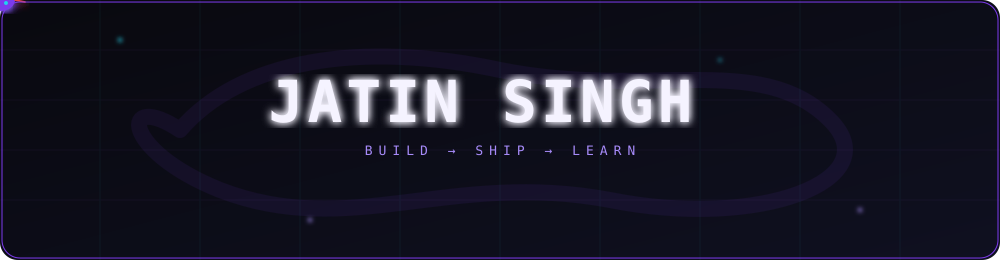

 

 

 

 

<table width="100%">
  <tr>
    <td width="60%" valign="top">
      <h3>⚡ About Me</h3>
      
Software engineer and Computer Engineering student at TSEC (Mumbai). I specialize in building robust products end-to-end—from headless e-commerce architectures to AI models and neural networks built entirely from scratch.

      
Most of my learning comes from shipping full-stack projects, managing my Arch Linux environments, and experimenting with new visualization technologies.

    </td>
    <td width="40%" valign="top">
      <h3>🎯 Focus & Interests</h3>
      <ul>
        <li>⚙️ Headless Architecture & API Design</li>
        <li>🧠 Machine Learning & Neural Networks</li>
        <li>🎨 Creative Coding (Three.js, Pygame)</li>
        <li>🐧 Linux System Admin & Docker</li>
        <li>🏎️ Formula 1 & Strategy Games</li>
      </ul>
    </td>
  </tr>
</table>

<table width="100%">
  <tr>
    <td valign="top" align="center">
      <h3>💻 Tech Stack</h3>
       
      
       
    </td>
  </tr>
</table>

 

*"Build → Ship → Learn"*

